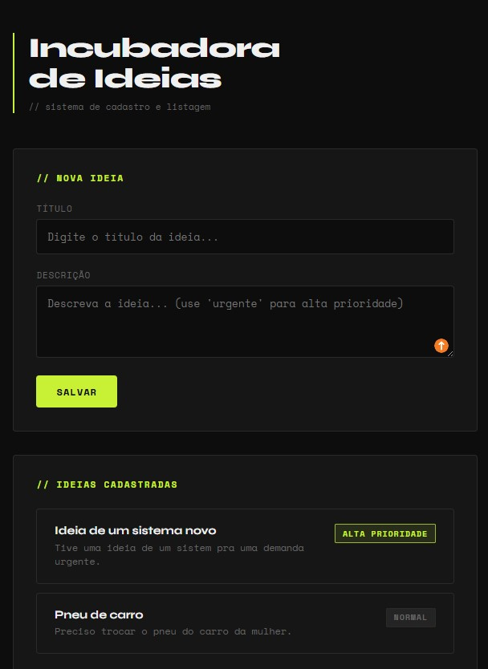

# Avaliação Dev Java Trainee Jr

Resolução das issues de avaliação técnica.

## Sobre o Projeto
API REST desenvolvida com Spring Boot para gerenciamento de ideias.

## Issues
- **Issue 1** – Criação da API fullstack com frontend integrado
- **Issue 2** – Análise de bugs, más práticas e refatoração do AprovacaoService seguindo princípios de Clean Code
- **Issue 3** – Análise de log, refatoraçao e correção de NullPointerException no RelatorioService

## Demonstração do Sistema



## Decisões Técnicas

Além do que foi especificado nas issues, algumas classes foram adicionadas por iniciativa própria para garantir o funcionamento correto da aplicação e seguir boas práticas:

- `Autor.java` e `Usuario.java` — models necessários para o funcionamento do `AprovacaoService` e `RelatorioService`
- `NivelAcesso.java` — enum para representar os níveis de acesso de forma semântica ao invés de usar inteiros soltos
- `GlobalExceptionHandler.java` — tratamento centralizado de exceções, retornando respostas HTTP adequadas (400) ao invés de erro 500 genérico

## Estrutura do Projeto
```
src/
└── main/
    ├── java/com/empresafake/
    │   ├── incubadora/
    │   │   └── IncubadoraApplication.java
    │   ├── controller/
    │   │   └── IdeiaController.java
    │   ├── model/
    │   │   ├── Ideia.java
    │   │   ├── Autor.java
    │   │   └── Usuario.java
    │   ├── service/
    │   │   ├── IdeiaService.java
    │   │   ├── AprovacaoService.java
    │   │   └── RelatorioService.java
    │   ├── enums/
    │   │   └── NivelAcesso.java
    │   └── exception/
    │       └── GlobalExceptionHandler.java
    └── resources/
        └── static/
            └── index.html
```

## Como Rodar
1. Clone o repositório
2. Execute `mvnw.cmd spring-boot:run` na raiz do projeto
3. Acesse `http://localhost:8080` no navegador

## Tecnologias
- Java 17
- Spring Boot
- HTML, CSS e JavaScript
